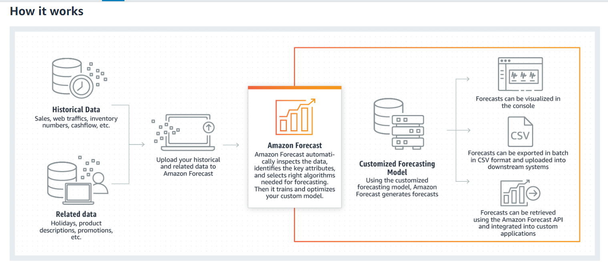

#  AI Service [AWS Forecast](https://aws.amazon.com/forecast/) on AWS sp20-516-255, Porwal, Prafull

## Overview

Amazon Forecast is a fully managed service for time-series forecasting. AWS Forecast uses machine learning to combine time series data with additional variables to provide highly accurate forecasts. There is no infratructure to maintain or machine learning models to build, train, or deploy.  User's need to provide historical data and any additional data that may impact forecasts. Users only pay for what they  use, and there is no minimum fees and no upfront commitments.

## Features of AWS Forecast 

* Amazon Forecast uses deep learning algorithms, such as DeepAR+ and traditional statistical methods for forecasting related time series data. Forecast works with any type of historical data and can combine affecting additional factors to produce more accurate forecasts than non machine learning tools or traditional tools.
* Provides set of pre-defined algorithms. No need to build, train, or deploy machine learning models, once data is provided, Forecast can load and inspect the data, select right algorithm , train a model, tune hyperparameter, model iteratively to provide accuracy metrics
* Provides visualized forecast for easy understanding and integrate with many existing tools.
* Tool generates probabilitic forecasts at different quantiles and for multiple backtest windows. User's can choose according to buisness needs and model accuracy

## High Level Architecture 

{#fig:sp20-516-255-AWS_Forecast}

## References

https://aws.amazon.com/forecast/
https://aws.amazon.com/forecast/features/
