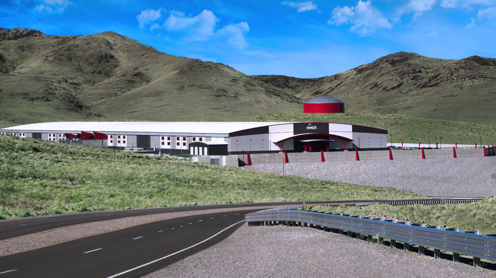

# Data Center, Prafull Porwal, sp20-516-255

## Define carbon footprint of data centers (E.Datacenter.1)

Carbon footprint of a data center is carbon emissions of a data center equivalent of the total amount of electricity consumed by the data center. 

## Switch TAHOE RENO, The Citadel Campus (E.Datacenter.2.b)

Switch is based in Las Vegas, Nevada. The company develops and operates the SUPERNAP data center facilities. 
The TAHOE RENO data center was announced in 2015 and opened its first center in February, 2017. 

Current : 
* Sqrt ft: 1.3 million square feet  
* Electricity Use: 130 MW  
* Energy Source : 100% Renewable

On Completion 
* Sqrt ft: 7.2 million square feet  
* Electricity Use: 650 MW  
* Energy Source : 100% Renewable

The company has received top spot from Green Peace 2016 in Clicking Clean Company scorecard for 100-percent Clean Energy Index.

@fig:sp20-516-255-TAHOE_RENO_Data_Center shows Switch The Citadel Campus, Reno Data Center

{#fig:sp20-516-255-TAHOE_RENO_Data_Center}

### Reference

<https://www.switch.com/tahoe-reno>

<https://www.switch.com/sustainability/#greenpeace>

<https://www.switch.com/switch-tahoe-reno-data-center-now-open/>

## My Own Carbon Footprint( E.Datacenter.3)

@fig:sp20-516-255-carbon_Emissions shows my own carbon footprint

{#fig:sp20-516-255-carbon_Emissions}

## Other Renewable Energy - Marine/Oceans Energy (E.Datacenter.4)

Marine energy is a form of renewable energy generated from ocean waves, tides, difference in salinity gradients and ocean temperature differences. Marine energy can be of two types 1. Power from surface waves. 2. Tidal Power : Power from movement of water.

Marine Energy is latest form of renewable energy being used by dataceneters. Few datacenters using or plan to use 
Ocean's energy are:

**Microsoft(Scotland)**:
Micorsoft recently announced a submarine-like self conatained data center called Project Natick.

**LefDal Mine (Norway)**:
Lefdal Mine Data Center uses Sea Water for cooling.

**SIMEC Atlantis (Scotland)**:
The Atalantis new datacenter operating fully on tidal energy will be operational 2024.

### Reference

<https://www.networkworld.com/article/3283332/microsoft-launches-undersea-free-cooling-data-center.html>

<https://www.energylivenews.com/2019/09/09/plans-unveiled-for-worlds-first-ocean-powered-data-centre-in-scotland>

## Google's efforts towards Renewable Energy (E.Datacenter.5)

Google, World's leading tech company, is the world’s largest corporate buyer of renewable energy. Google has actively persued 
the use of renewable engery to power the datacenters and offices. In 2016, the company was able to cover 57% of its energy use with
renewables and then Google signed long term contracts with solar and wind energy farms to purchase same amount of renewable energy 
it consumes for the year. Google has met the target for 2017 and 2018 years and expected to meet for 2019 as well 

@fig:sp20-516-255-Google_renewable_Energy shows YoY Google's purchase of renewable energy.

{#fig:sp20-516-255-Google_renewable_Energy}

Google has been leading the renewable energy efforts, below chart shows Google effort's in comparasion to similar large organizations.

@fig:sp20-516-255_Google_renewable shows Google's renewable energy purchase in comparasion to other large corporations.

{#fig:sp20-516-255_Google_renewable}

### Reference

<https://www.google.com/about/datacenters/renewable/>

<https://sustainability.google/projects/announcement-100/>

<https://www.blog.google/outreach-initiatives/sustainability/our-biggest-renewable-energy-purchase-ever/>

## Data Center Cooling Technologies(E.Datacenter.6)

There are multiple technologies to maintain the temperature in datacenter.

* Calibrated Vectored Cooling (CVC) 
* Chilled Water System
* Cold Aisle/Hot Aisle Design
* Direct-to-Chip Cooling
* Evaporative Cooling
* Free Cooling
* Liquid Cooling

### Reference

<https://www.raritan.com/ap/blog/detail/types-of-data-center-cooling-techniques>

<https://www.vxchnge.com/blog/data-center-cooling-technology>
